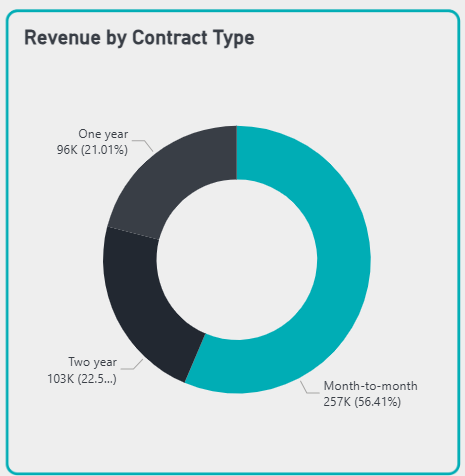
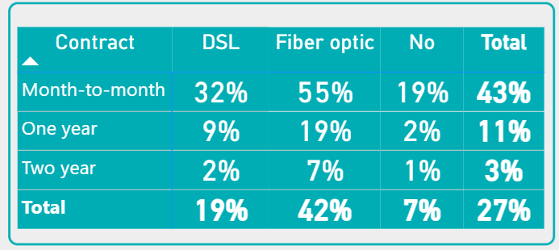

# 📊 Customer Churn & Revenue Assurance Analysis

## **Project Background**
This project analyzes customer retention within the telecommunications industry to identify the primary drivers of churn. The objective is to transform raw subscriber data into actionable business strategies to mitigate **Revenue Leakage** and optimize **Monthly Recurring Revenue (MRR)**.

Insights and recommendations are provided on the following key areas:
* **Contractual Risk Analysis:** Evaluation of how contract types impact revenue stability.
* **Service Correlation:** Assessment of support services (e.g., Tech Support) on customer loyalty.
* **Customer Lifecycle Trends:** Identification of critical windows where customers are most likely to attrite.

---

# 📊 Customer Churn & Revenue Assurance Analysis

## **Project Background**
This project analyzes customer retention within the telecommunications industry to identify the primary drivers of churn. The objective is to transform raw subscriber data into actionable business strategies to mitigate **Revenue Leakage** and optimize **Monthly Recurring Revenue (MRR)**.

Insights and recommendations are provided on the following key areas:
* **Contractual Risk Analysis:** Evaluation of how contract types impact revenue stability.
* **Service Correlation:** Assessment of support services (e.g., Tech Support) on customer loyalty.
* **Customer Lifecycle Trends:** Identification of critical windows where customers are most likely to attrite.

---

## **Visual Intelligence Overview**

### **1. Executive Revenue & Churn KPIs**

* **Analysis:** The dashboard monitors four core metrics: Total Customers (**7,043**), Churn Rate (**27%**), Total MRR (**$456.12K**), and Lost MRR (**$139.13K**).
* **Business Insight:** A **27% churn rate** indicates a significant revenue leak of **$139K**. This identifies a massive opportunity for recovery through targeted retention interventions.

### **2. Revenue Composition by Contract Type**

* **Analysis:** The donut chart reveals that **56.41% ($257K)** of total revenue is tied to **Month-to-Month** contracts.
* **Business Insight:** High concentration of short-term contracts creates a high-risk financial profile. While it's the largest revenue source, it is also the most volatile and prone to sudden leakage.

### **3. Churn Risk Matrix (Contract vs. Service)**

* **Analysis:** The matrix identifies a "Risk Hotspot" in **Month-to-month Fiber Optic** users with a **55% churn rate**.
* **Business Insight:** This is the most critical segment. High-tier service costs combined with zero contractual commitment create a "Perfect Storm" for churn, requiring immediate strategic intervention.

### **4. Behavioral Drivers (Tenure & Support)**

* **Analysis:** Churn velocity peaks in the **first 6 months** (>50%), but customers with **Tech Support** have their churn probability **cut in half (15% vs 31%)**.
* **Business Insight:** Loyalty is won in the first semester. By proactively engaging new users with Tech Support services, we can effectively secure revenue that would otherwise be lost in the "Danger Zone."

---

## **Key Business Insights**
* **Financial Exposure:** Month-to-month contracts represent the highest source of revenue loss.
* **Retention Drivers:** Customers utilizing **Technical Support** show a 3x higher retention rate compared to those without.
* **Churn Window:** The highest risk of attrition occurs within the first **0-6 months** of the customer lifecycle.

---

## **Strategic Recommendations**

### **1. Revenue Stabilization & Contract Conversion**
* **Incentivized Migration:** Launch a "Lock-in Loyalty" campaign targeting high-value Month-to-Month subscribers with a 10-15% discount for a 12-month commitment.
* **Risk-Based Pricing:** Evaluate a small premium for month-to-month flexibility to encourage the adoption of stable long-term contracts.

### **2. Service-Led Retention (Product Bundling)**
* **Technical Support Integration:** Bundle "Tech Support" as a standard feature for high-churn segments like Fiber Optic users.
* **Self-Service Support:** Invest in AI-driven self-service tools to reduce technical friction for customers.

### **3. Early Lifecycle Management (The "First 100 Days")**
* **Predictive Onboarding:** Implement an automated "Success Sequence" during the first 90 days with proactive health-check emails.
* **Early Warning System:** Use the "Risk Heatmap" to trigger automated outreach to customers exhibiting "Pre-Churn" behavior.

### **4. Payment Friction Reduction**
* **Auto-Pay Incentives:** Encourage transition from "Electronic Check" to "Auto-Pay" via a one-time bill credit to reduce manual payment failures.

---

## **Technical Resources**
* 📊 **Interactive Dashboard:** [View on NovyPro/PowerBI Service](#)
* 📁 **SQL Queries (Cleaning & Prep):** [View SQL Scripts](./SQL_Scripts)
* 📑 **Business Analysis Queries:** [View SQL Insights](./SQL_Analysis)
---

## **Key Business Insights**
* **Financial Exposure:** Month-to-month contracts represent the highest source of revenue loss.
* **Retention Drivers:** Customers utilizing **Technical Support** show a 3x higher retention rate compared to those without.
* **Churn Window:** The highest risk of attrition occurs within the first **0-6 months** of the customer lifecycle.

---

## **Strategic Recommendations**

### **1. Revenue Stabilization & Contract Conversion**
* **Incentivized Migration:** Launch a "Lock-in Loyalty" campaign targeting high-value Month-to-Month subscribers with a 10-15% discount for a 12-month commitment.
* **Risk-Based Pricing:** Evaluate a small premium for month-to-month flexibility to encourage the adoption of stable long-term contracts.

### **2. Service-Led Retention (Product Bundling)**
* **Technical Support Integration:** Bundle "Tech Support" as a standard feature for high-churn segments like Fiber Optic users.
* **Self-Service Support:** Invest in AI-driven self-service tools to reduce technical friction for customers.

### **3. Early Lifecycle Management (The "First 100 Days")**
* **Predictive Onboarding:** Implement an automated "Success Sequence" during the first 90 days with proactive health-check emails.
* **Early Warning System:** Use the "Risk Heatmap" to trigger automated outreach to customers exhibiting "Pre-Churn" behavior.

### **4. Payment Friction Reduction**
* **Auto-Pay Incentives:** Encourage transition from "Electronic Check" to "Auto-Pay" via a one-time bill credit to reduce manual payment failures.

---

## **Technical Resources**
* 📊 **Interactive Dashboard:** [View on NovyPro/PowerBI Service](#)
* 📁 **SQL Queries (Cleaning & Prep):** [View SQL Scripts](./SQL_Scripts)
* 📑 **Business Analysis Queries:** [View SQL Insights](./SQL_Analysis)
