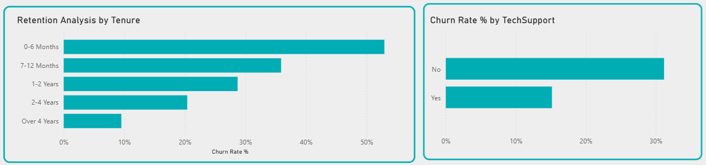

# 📊 Customer Churn & Revenue Assurance Analysis

## 📌 Project Background

This project analyzes customer retention within the telecommunications industry using the **Telco Customer Churn** dataset (7,043 subscribers). The objective is to transform raw subscriber data into actionable business strategies to mitigate **Revenue Leakage** and optimize **Monthly Recurring Revenue (MRR)**.

The analysis is framed around three business questions:
1. **Contractual Risk** — How does contract type affect revenue stability?
2. **Service Correlation** — Do support services (e.g., Tech Support) improve customer loyalty?
3. **Customer Lifecycle** — When exactly are customers most likely to churn?

Insights and recommendations are provided across four focus areas: contract risk, service stickiness, customer lifecycle timing, and payment friction.

---

## 🛠️ Tools & Data

| Component | Detail |
|---|---|
| **Dataset** | [Telco Customer Churn](https://www.kaggle.com/datasets/blastchar/telco-customer-churn) — 7,043 rows, 21 columns |
| **Data Cleaning & Analysis** | SQL (aggregations, CTEs, conditional aggregation) |
| **Visualization** | Power BI |
| **Key columns used** | `Contract`, `InternetService`, `tenure`, `MonthlyCharges`, `Churn`, `TechSupport`, `OnlineSecurity`, `PaymentMethod` |

---

## 📈 Visual Intelligence Overview

### 1. Executive Revenue & Churn KPIs

**Metrics tracked:** Total Customers (**7,043**), Churn Rate (**27%**), Total MRR (**$456.12K**), Lost MRR (**$139.13K**).

**Business Insight:** A 27% churn rate translates to **$139K in monthly recurring revenue lost** — roughly 30% of total MRR. This single number frames the entire analysis: retention isn't a support metric here, it's a revenue-protection problem.

### 2. Revenue Composition by Contract Type

**Analysis:** Month-to-month contracts account for **56.41% ($257K)** of total revenue, versus 22.5% (Two year) and 21.01% (One year).

**Business Insight:** More than half the company's revenue sits on the least stable contract type. This concentration is the root cause of the volatility seen in every other chart on this dashboard.

### 3. Churn Risk Matrix — Contract × Internet Service

**Analysis:** Cross-tabbing Contract against InternetService surfaces a clear "Risk Hotspot": **Month-to-month + Fiber Optic** customers churn at **55%**, compared to single-digit churn in two-year contracts across every service tier.

**Business Insight:** This segment is where cost, flexibility, and churn intersect — Fiber Optic is the premium-priced service, and month-to-month gives customers zero friction to leave. It's the single highest-value target for intervention.

### 4. Behavioral Drivers — Tenure & Tech Support

**Analysis:** Churn velocity peaks in the **first 6 months** (>50% of all churn events), then drops sharply. Customers with Tech Support churn at **15%**, versus **31%** for those without — roughly half.

**Business Insight:** Loyalty is largely decided early. The first 6 months function as a "trial period" in the customer's mind — proactive support during this window has an outsized effect on lifetime retention.

---

## 💡 Key Business Insights

- **Financial Exposure:** Month-to-month contracts are both the largest revenue source (56%) and the largest source of loss — a structural risk, not a random one.
- **Retention Drivers:** Tech Support roughly **halves** churn probability (31% → 15%).
- **Churn Window:** Over half of all churn happens in the customer's **first 6 months**.
- **Highest-Risk Segment:** Month-to-month + Fiber Optic customers churn at **55%** — nearly double the overall average.

---

## ✅ Strategic Recommendations

### 1. Revenue Stabilization & Contract Conversion
- **Lock-in Loyalty campaign:** 10–15% discount for month-to-month subscribers who commit to a 12-month contract.
- **Risk-based pricing:** evaluate a small flexibility premium on month-to-month plans to nudge adoption of longer terms.

### 2. Service-Led Retention (Product Bundling)
- **Bundle Tech Support** as a standard feature for high-churn segments, especially Fiber Optic.
- **Self-service tools:** invest in AI-driven support to reduce technical friction without added headcount.

### 3. Early Lifecycle Management ("First 100 Days")
- **Predictive onboarding:** automated health-check sequence in the first 90 days.
- **Early warning system:** flag "pre-churn" behavior patterns for proactive outreach before month 6.

### 4. Payment Friction Reduction
- **Auto-pay incentive:** one-time bill credit to migrate customers off Electronic Check, which correlates with higher churn.

---

## 📁 Project Structure
├── Images/ # Dashboard screenshots
├── Dashboard/ # Power BI file / exported dashboard views
├── SQL_Analysis/ # Business insight queries
├── SQL_Scripts/ # Data cleaning & prep queries
└── README.md

---

---

## 👤 Author

**Fauzan Rafli** — [GitHub](https://github.com/Fauzann79)
